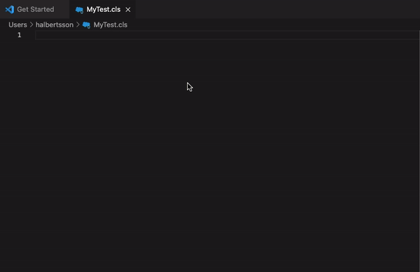

# Apex Mocks Snippets

This is an extension to make it easier to develop with Apex mocks by providing useful code snippets.

<https://github.com/apex-enterprise-patterns/fflib-apex-mocks>

## Snippets

Where there are blanks - the snippet will default the cursor to populate the blank.
If there are multiple blanks, after populating the first one, pressing tab will take the cursor to
the next slot.



APEX_MOCKS is provided as a default name for the Mock Builder but will be highlighted by default
and will be overridable immediately.

### unit-test

```java
@IsTest(isParallel=true)
class Filename {
    @IsTest
    public static void methodUnderTest_changes_expectedResult() {
        Test.startTest();
        Test.stopTest();
    }
}
```

### test-case

```java
@isTest
public static void methodUnderTest_changes_expectedResult() {
    Test.startTest();
    Test.stopTest();
}
```

### answer

```java
private with sharing class Answer implements fflib_Answer {
    public Answer() {}
    public Object answer(fflib_InvocationOnMock invocation) {
          ArgumentType argumentOne = (ArgumentType) invocation.getArgument(0);

          return null;
    }
}
```

### asserte

```java
System.assertEquals(, , );
```

### assert

```java
System.assert(, );
```

### fflib-asserte

```java
fflib_System.assertEquals(fflib_Match.(), ,);
```

### startStubbing

```java
APEX_MOCKS.startStubbing();

APEX_MOCKS.stopStubbing();
```

### startTest

```java
Test.startTest();

Test.stopTest();
```

### create-mock-builder

```java
fflib_ApexMocks APEX_MOCKS = new fflib_ApexMocks();
```

### argumentCaptor

```java
fflib_ArgumentCaptor serviceParmsCaptor = fflib_ArgumentCaptor.forClass(
    .class
);
```

### capture-argument

```java
(Type) .capture()
```

### verify-calls

```java
((Service) APEX_MOCKS.verify(serviceToMock, 1)).methodName((ArgumentType) fflib_Match.anyObject());
```

### create-mock

```java
mockService = () APEX_MOCKS.mock(.class)
```

### doThrowWhen

```java
((ServiceType) APEX_MOCKS.doThrowWhen(
    new TestException('Splat!'),
    mockService
))
.methodName((ArgumentType) fflib_Match.anyObject());
```

### thenReturn

```java
APEX_MOCKS.when(
    mockService.methodName((ArgumentType) fflib_Match.anyObject())
)
.thenReturn(mockResult);
```

### thenAnswer

```java
APEX_MOCKS.when(
    mockService.methodName((ArgumentType) fflib_Match.anyObject())
)
.thenAnswer(answerInstance);
```

### runAs

```java
System.runAs() {

}
```
